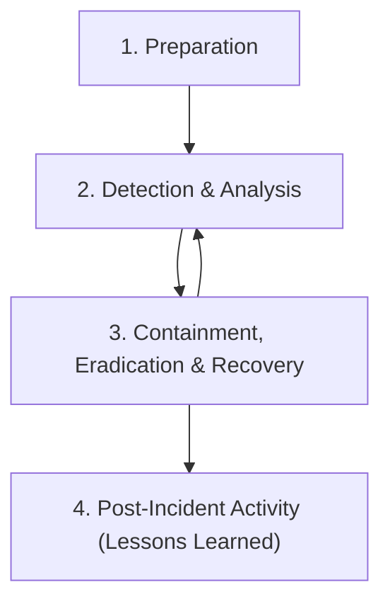

# Task 16: Incident Response & Security Breach Simulation

## Objective
To understand incident response workflows (following NIST SP 800-61 r2 guidelines), investigate log event correlation timelines, and construct a containment playbook for security breach events.

---

## The Incident Response Lifecycle (NIST Framework)



### 1. Preparation
Establishing detection tools, logging configurations, communication guidelines, and training incident responders.

### 2. Detection & Analysis
Identifying precursors and indicators of a threat breach (e.g., verifying log anomalies, threat indicators, and system modifications).

### 3. Containment, Eradication & Recovery
* **Containment:** Minimizing damage and stopping the attacker from spreading laterally (e.g., disconnecting compromised VMs from network).
* **Eradication:** Removing all components of the threat (e.g., deleting malware shells, patching vulnerabilities).
* **Recovery:** Restoring systems to normal operation (e.g., restoring from clean backups).

### 4. Post-Incident Activity
Reviewing the incident, identifying root causes, and updating security controls to prevent recurrence.

---

## Implementation Details

A Python analyzer `incident_response_analyzer.py` was built to correlate system events during a simulated corporate network security breach.

### Running the Analyzer
Run the forensic analysis script:
```bash
python incident_response_analyzer.py
```

### Forensic Investigation Timeline Output
```text
[*] Performing Forensic Log Analysis...

================================================================================
                 INCIDENT RESPONSE FORENSIC REPORT
================================================================================

COMPROMISED INTERNAL ASSETS:
  - [Compromised] WebServer
  - [Compromised] DB-Server

IDENTIFIED ATTACKER IP ADDRESSES:
  - [Attacker C2] 198.51.100.44

ESTIMATED DATA EXFILTRATED: 4.8 GB

ATTACK TIMELINE OF EVENTS:
Timestamp            | Phase                | Details
--------------------------------------------------------------------------------
2026-06-20T10:05:00  | INITIAL COMPROMISE   | Adversary uploaded/executed shell on WebServer-WAF
2026-06-20T10:06:00  | INITIAL COMPROMISE   | Adversary uploaded/executed shell on WebServer-Runtime
2026-06-20T10:10:00  | COMMAND & CONTROL    | Reverse shell established to attacker IP 198.51.100.44
2026-06-20T10:20:00  | LATERAL MOVEMENT     | Adversary moved laterally from WebServer to DB-Server via SSH using stolen credentials
2026-06-20T10:30:00  | DATA EXFILTRATION    | Data exfiltrated to attacker server. Volume: 4.8 GB

CONTAINMENT & REMEDIATION RECOMMENDATIONS:
  1. ISOLATE WebServer (192.168.1.10) and DB-Server (192.168.2.50) from the network immediately.
  2. TERMINATE active outbound TCP connections to attacker IP 198.51.100.44.
  3. REVOKE 'db_backup_admin' database credentials and rotation credentials across all services.
  4. PURGE uploaded file 'cmd.jsp' and patch file-upload parameters on the web app.
================================================================================
```

---

## Incident Remediation Playbook (Action Items)

1. **Short-Term Containment:** Isolate the Web Server and Database Server immediately by modifying firewall ACLs (Virtual Network Security Group controls) to prevent lateral communication and halt data exfiltration.
2. **Eradication:** Delete `cmd.jsp` and conduct a full file-integrity scan to locate any other backdoors. Re-image/restore operating systems to a known clean state.
3. **Password Reset:** Rotate all administrative credentials, API secrets, and SSH keys.
4. **Vulnerability Mitigation:** Fix file upload endpoints by restricting file extensions to non-executable types (e.g., blocking `.jsp`, `.php`, `.sh` formats) and saving uploaded assets outside the web root.
